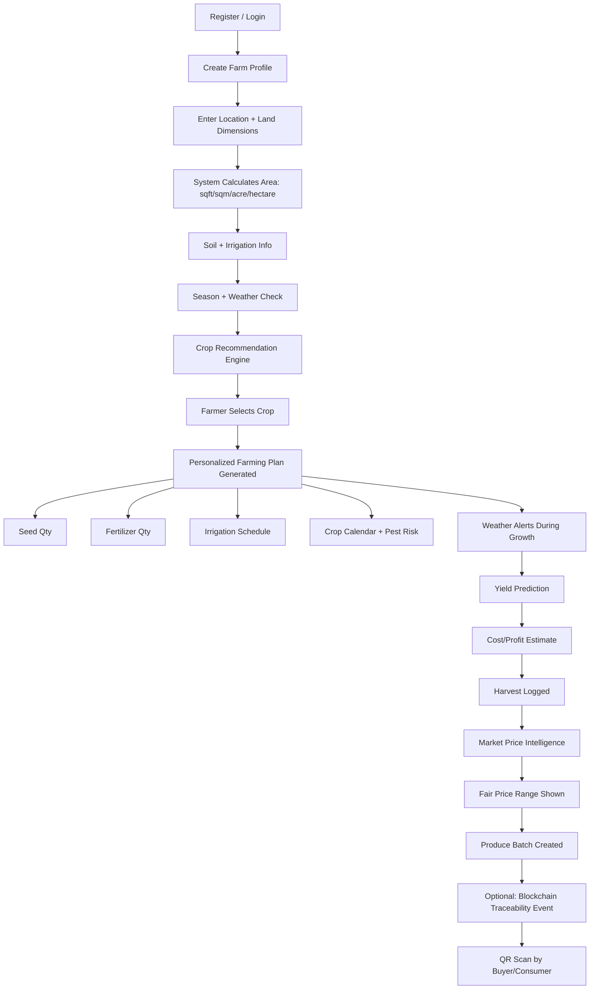
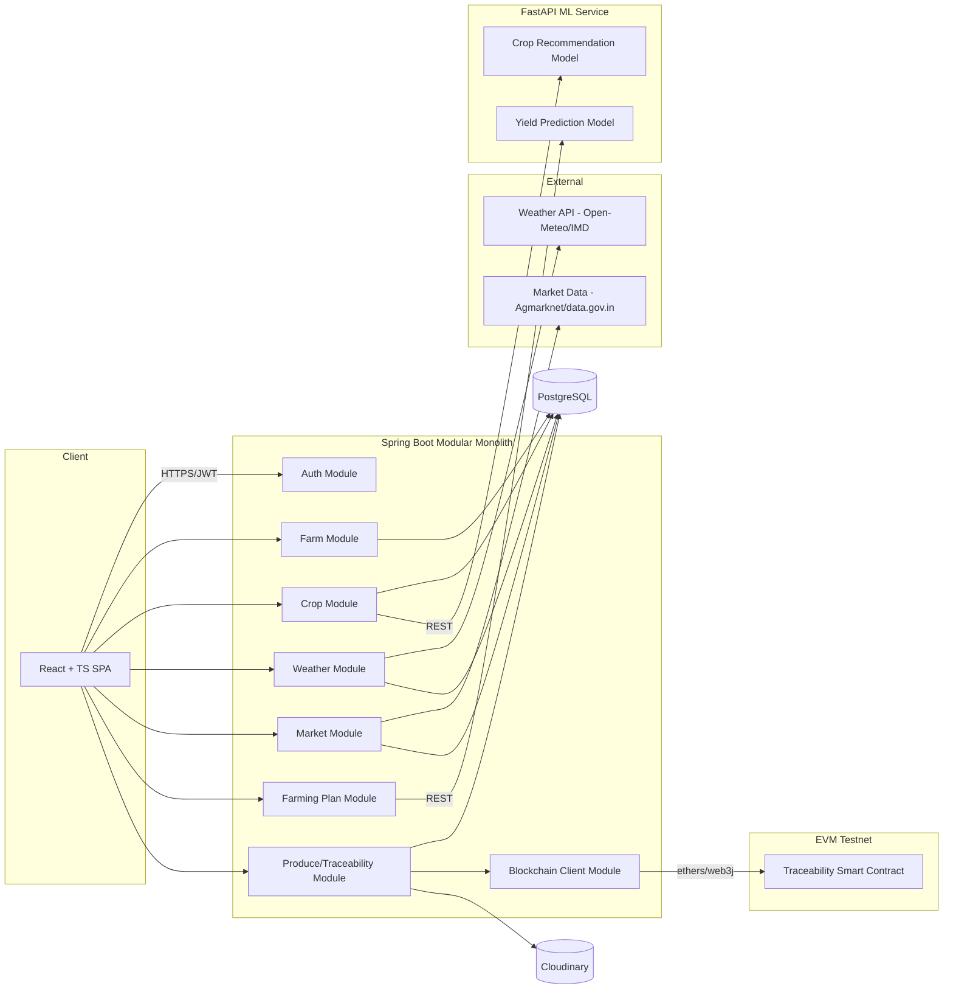

# FarmChain — Master Engineering Blueprint


---

## 1. Executive Summary

FarmChain is a farmer-centric agricultural decision-support platform: farm profile → land measurement → crop recommendation → personalized input calculator → weather/climate intelligence → cost/yield estimation → market price transparency → optional blockchain traceability. It is explicitly **not** an AI chatbot wrapper — AI/ML is used only where deterministic logic can't solve the problem (crop suitability scoring, yield ranges, disease image classification). Everything else — unit conversion, NPK-per-hectare scaling, cost math, weather rule-based alerts — is deterministic and auditable.

The MVP is designed to run at **₹0** using free-tier PostgreSQL (Neon/Supabase), free-tier backend hosting (Render), free frontend hosting (Vercel), open government/meteorological data, and an EVM testnet for blockchain. Every "free" claim below is labeled with its limitation and a migration path, because free tiers change — verify current limits before deploying, don't take this document's specifics as permanently accurate.

---

## 2. Product Vision & Problem Statement

**Problem:** Indian smallholder farmers make three consequential decisions — what to grow, how to grow it, and where to sell it — largely on habit, informal advice, or middlemen information, without personalized, localized, or transparent data. Government agricultural data (ICAR advisories, IMD weather, Agmarknet prices) exists but is fragmented, not personalized to a specific farmer's land size, and not surfaced in a usable mobile-first interface.

**Vision:** One platform that takes a farmer from "what should I grow" to "how much should I sell it for," using verified agricultural knowledge (not LLM-invented facts) scaled to the farmer's actual land size, with transparent, sourced market pricing.

---

## 3. Target Users

| Role | Primary need |
|---|---|
| Farmer | Personalized crop/input/cost guidance + fair price visibility |
| Buyer/Wholesaler | Discover available produce with quantity, quality, location |
| Consumer | Verify produce provenance via QR |
| Admin | Curate agricultural knowledge, moderate listings, manage market data ingestion |

---

## 4. Core User Journey



---

## 5. Functional Requirements (MVP-relevant excerpt)

- Farm CRUD with automatic area calculation across units (sqft, sqm, acre, hectare, state-specific bigha)
- Rule-based crop calendar filtering (season + region + soil) as the baseline; ML recommendation as a ranking layer on top, not a replacement
- Deterministic input calculator: knowledge-base "per hectare" values × farmer's actual hectares
- Weather ingestion + caching + rule-based alert engine
- Cost/profit calculator from farmer-entered/estimated expenses
- Market price display with mandatory source + timestamp
- Produce batch + QR generation; blockchain event logging optional per batch
- RBAC: Farmer / Buyer / Consumer(public, no login needed for QR scan) / Admin

## 6. Non-Functional Requirements

- ₹0 infra for MVP scale (few hundred users)
- API p95 latency target <500ms for cached endpoints, <2s for live external-API-backed endpoints
- Mobile-first, functional on 3G, Hindi/Hinglish support
- No agricultural fact displayed without a source + last-updated date
- No fabricated ML precision — ranges, not false-precision numbers

---

## 7. MVP vs V1 vs V2 vs Future

| Tier | Scope |
|---|---|
| **MVP** | Farm profile + area calc, rule-based crop suggestion (no ML yet), knowledge-based input calculator, weather display + basic alerts, manual cost/profit calculator, market price display (read-only, sourced), single-crop farming plan, produce batch record (DB only, no blockchain yet) |
| **V1** | ML crop recommendation model, yield prediction, blockchain traceability (testnet), buyer/consumer QR flow, notifications |
| **V2** | Disease detection (image upload), multilingual RAG assistant, fair-price engine with multi-market comparison, admin knowledge-management console |
| **Future/Research** | Regional-language voice interface, mainnet blockchain, insurance/logistics partner integrations, offline-first PWA sync |

This staging matters: **MVP does not need ML or blockchain to be useful.** Both are added once the deterministic core works — this avoids building fragile ML/blockchain plumbing before the product itself is validated.

---

## 8. Technology Stack — Decisions

| Layer | Choice | Why | Rejected alternative |
|---|---|---|---|
| Frontend | React + TypeScript + Vite | You already have working React+Vite+TS experience (Jankalyan, portfolio) — zero new tooling risk | Next.js — SSR not needed for an authenticated dashboard app; adds hosting complexity for free tier |
| Backend | Spring Boot (Java) | Matches your existing skill set (Java/Spring Boot from Jankalyan/DevLens) and is what recruiters will ask about | Node/Express — would be a second backend language to maintain for no architectural gain here |
| Database | PostgreSQL | Relational integrity matters (farms→crops→batches→traceability is deeply relational); free-tier hosted Postgres (Neon or Supabase) is mature | MongoDB — no schema-flexibility need justifies giving up FK integrity |
| ML service | Python + FastAPI + scikit-learn | Crop recommendation/yield prediction are tabular problems — scikit-learn (RandomForest/XGBoost) is appropriate; deep learning is unjustified until disease-detection (CV) phase | Doing ML inside Spring Boot via DL4J — smaller ecosystem, worse for rapid iteration and worse resume signal (Python/FastAPI is the expected ML-serving pattern) |
| Blockchain | Solidity on an EVM testnet (Polygon Amoy or similar — verify current active testnet before building) | Batch/ownership events need tamper-evident logging; EVM tooling (Hardhat, ethers.js) is the most job-relevant blockchain stack | Hyperledger Fabric — enterprise-grade permissioned chain is overkill for a solo ₹0 MVP and has a much steeper free-hosting story |
| Image/object storage | Cloudinary free tier | You already use it in Jankalyan | Self-hosted MinIO — extra ops burden for no MVP benefit |
| Frontend hosting | Vercel | Free tier, already your deployment target for Jankalyan/portfolio | — |
| Backend hosting | Render free tier | Free tier supports Spring Boot JAR/Docker deploys; **known limitation: free instances spin down after inactivity, causing cold-start delay** — document this as an MVP limitation | Railway — smaller free allowance historically; verify current pricing before choosing |
| ML hosting | Same Render account, separate free service (or Hugging Face Spaces free tier for a lightweight FastAPI app) | Keeps everything in one free ecosystem | — |

---

## 9. Modular Monolith vs Microservices — Decision

**Decision: Modular Monolith (Spring Boot) + one separate ML microservice (FastAPI) + one separate blockchain-interaction module.**

Reasoning: You are a solo developer at ₹0 budget. Full microservices (separate deployable services per domain) multiply hosting cost, deployment complexity, and inter-service auth — none of which you can absorb for free, and none of which is needed at MVP scale. A **modular monolith** — Spring Boot with strict package boundaries (`farm`, `crop`, `weather`, `market`, `blockchain-client`, `auth`) and no cross-module direct repository access — gives you the same "clean boundaries" story for interviews without the operational cost. ML is split out only because it's a different language/runtime, not because of scale.

Future extraction path: because modules only talk to each other through service interfaces (never repositories directly), any module can later become its own Spring Boot service behind the same interface contract without a rewrite.

---

## 10. High-Level Architecture



Key rule: **the React frontend never calls external weather/market APIs or the blockchain directly.** Everything routes through Spring Boot, which caches and normalizes — this protects the frontend from third-party rate limits/downtime and keeps API keys server-side only.

---

## 11. Backend Module Structure

```
backend/
├── src/main/java/com/farmchain/
│   ├── auth/            # JWT, refresh tokens, RBAC
│   ├── farm/             # farm profile, land measurement, unit conversion
│   ├── crop/              # crop catalog, recommendation orchestration
│   ├── knowledge/       # agricultural knowledge base (seed/fertilizer/calendar)
│   ├── calculator/     # deterministic input/cost calculators
│   ├── weather/          # external weather ingestion + caching + alert rules
│   ├── plan/               # farming plan generation, tasks
│   ├── market/            # price ingestion, fair-price range logic
│   ├── batch/              # produce batch, traceability event log
│   ├── blockchainclient/ # smart contract interaction, tx status tracking
│   ├── notification/  # in-app + email notification dispatch
│   ├── admin/              # knowledge/user/report management
│   └── common/           # shared DTOs, exceptions, response envelope
```

Cross-module rule: a module may only depend on another module's public `*Service` interface, never its `*Repository`. This is the enforceable "clean architecture" boundary that also happens to be exactly what a future microservice split would follow.

---

## 12. Database Schema (core tables, simplified DDL)

```sql
-- Users & RBAC
CREATE TABLE users (
    id UUID PRIMARY KEY DEFAULT gen_random_uuid(),
    email VARCHAR(255) UNIQUE NOT NULL,
    password_hash TEXT NOT NULL,
    full_name VARCHAR(255) NOT NULL,
    role VARCHAR(20) NOT NULL CHECK (role IN ('FARMER','BUYER','ADMIN')),
    phone VARCHAR(20),
    preferred_language VARCHAR(10) DEFAULT 'en',
    is_active BOOLEAN DEFAULT TRUE,
    created_at TIMESTAMPTZ DEFAULT now(),
    updated_at TIMESTAMPTZ DEFAULT now()
);

-- Farms
CREATE TABLE farms (
    id UUID PRIMARY KEY DEFAULT gen_random_uuid(),
    owner_id UUID NOT NULL REFERENCES users(id),
    farm_name VARCHAR(255) NOT NULL,
    state VARCHAR(100) NOT NULL,
    district VARCHAR(100) NOT NULL,
    village VARCHAR(100),
    latitude DECIMAL(9,6),
    longitude DECIMAL(9,6),
    created_at TIMESTAMPTZ DEFAULT now(),
    deleted_at TIMESTAMPTZ  -- soft delete
);

CREATE TABLE farm_measurements (
    id UUID PRIMARY KEY DEFAULT gen_random_uuid(),
    farm_id UUID NOT NULL REFERENCES farms(id),
    length_value DECIMAL(10,2) NOT NULL,
    width_value DECIMAL(10,2) NOT NULL,
    input_unit VARCHAR(20) NOT NULL,     -- feet, meter
    area_sqft DECIMAL(14,2) NOT NULL,     -- always store canonical sqft
    area_sqm DECIMAL(14,2) NOT NULL,
    area_acre DECIMAL(10,4) NOT NULL,
    area_hectare DECIMAL(10,4) NOT NULL,
    area_bigha DECIMAL(10,4),                    -- nullable: only if state has defined conversion
    bigha_state_variant VARCHAR(100),   -- e.g. 'UP_KACHA', 'RAJASTHAN_PUCCA'
    created_at TIMESTAMPTZ DEFAULT now()
);

CREATE TABLE soil_profiles (
    id UUID PRIMARY KEY DEFAULT gen_random_uuid(),
    farm_id UUID NOT NULL REFERENCES farms(id),
    soil_type VARCHAR(50),
    ph_value DECIMAL(3,1),
    irrigation_available BOOLEAN,
    water_source VARCHAR(50),
    created_at TIMESTAMPTZ DEFAULT now()
);

-- Crop knowledge (deterministic, sourced)
CREATE TABLE crops (
    id UUID PRIMARY KEY DEFAULT gen_random_uuid(),
    name VARCHAR(100) NOT NULL,
    scientific_name VARCHAR(150),
    category VARCHAR(50)
);

CREATE TABLE crop_varieties (
    id UUID PRIMARY KEY DEFAULT gen_random_uuid(),
    crop_id UUID NOT NULL REFERENCES crops(id),
    variety_name VARCHAR(150),
    duration_days INT,
    region_suitability TEXT[]
);

CREATE TABLE agricultural_knowledge (
    id UUID PRIMARY KEY DEFAULT gen_random_uuid(),
    crop_id UUID NOT NULL REFERENCES crops(id),
    variety_id UUID REFERENCES crop_varieties(id),
    region VARCHAR(100),
    season VARCHAR(50),
    knowledge_type VARCHAR(50) NOT NULL,  -- SEED, FERTILIZER, IRRIGATION, PEST, HARVEST
    per_hectare_value DECIMAL(12,3),
    unit VARCHAR(20),
    source_name VARCHAR(255) NOT NULL,        -- e.g. 'ICAR', 'State Agri Dept UP'
    source_url TEXT,
    published_date DATE,
    confidence_level VARCHAR(20) DEFAULT 'OFFICIAL',
    created_at TIMESTAMPTZ DEFAULT now()
);

-- Weather (cached)
CREATE TABLE weather_data (
    id UUID PRIMARY KEY DEFAULT gen_random_uuid(),
    latitude DECIMAL(9,6) NOT NULL,
    longitude DECIMAL(9,6) NOT NULL,
    fetched_at TIMESTAMPTZ NOT NULL,
    forecast_date DATE NOT NULL,
    temperature_c DECIMAL(5,2),
    humidity_pct DECIMAL(5,2),
    rainfall_mm DECIMAL(6,2),
    wind_kmph DECIMAL(5,2),
    source VARCHAR(50) NOT NULL
);

CREATE TABLE weather_alerts (
    id UUID PRIMARY KEY DEFAULT gen_random_uuid(),
    farm_id UUID NOT NULL REFERENCES farms(id),
    alert_type VARCHAR(50) NOT NULL,
    message TEXT NOT NULL,
    severity VARCHAR(20),
    triggered_at TIMESTAMPTZ DEFAULT now(),
    acknowledged BOOLEAN DEFAULT FALSE
);

-- Farming plan
CREATE TABLE farming_plans (
    id UUID PRIMARY KEY DEFAULT gen_random_uuid(),
    farm_id UUID NOT NULL REFERENCES farms(id),
    crop_id UUID NOT NULL REFERENCES crops(id),
    variety_id UUID REFERENCES crop_varieties(id),
    sowing_date DATE,
    expected_harvest_date DATE,
    status VARCHAR(20) DEFAULT 'ACTIVE',  -- ACTIVE, HARVESTED, ABANDONED
    created_at TIMESTAMPTZ DEFAULT now()
);

CREATE TABLE farming_tasks (
    id UUID PRIMARY KEY DEFAULT gen_random_uuid(),
    plan_id UUID NOT NULL REFERENCES farming_plans(id),
    task_type VARCHAR(50),
    due_date DATE,
    is_completed BOOLEAN DEFAULT FALSE,
    notes TEXT
);

-- Expenses / yield / harvest
CREATE TABLE expenses (
    id UUID PRIMARY KEY DEFAULT gen_random_uuid(),
    plan_id UUID NOT NULL REFERENCES farming_plans(id),
    category VARCHAR(50),   -- SEED, FERTILIZER, LABOUR, IRRIGATION, OTHER
    amount DECIMAL(12,2),
    incurred_at DATE
);

CREATE TABLE yield_predictions (
    id UUID PRIMARY KEY DEFAULT gen_random_uuid(),
    plan_id UUID NOT NULL REFERENCES farming_plans(id),
    predicted_min_kg DECIMAL(12,2),
    predicted_max_kg DECIMAL(12,2),
    model_version VARCHAR(50),
    predicted_at TIMESTAMPTZ DEFAULT now()
);

CREATE TABLE harvests (
    id UUID PRIMARY KEY DEFAULT gen_random_uuid(),
    plan_id UUID NOT NULL REFERENCES farming_plans(id),
    actual_quantity_kg DECIMAL(12,2),
    harvest_date DATE,
    quality_grade VARCHAR(20)
);

-- Market
CREATE TABLE markets (
    id UUID PRIMARY KEY DEFAULT gen_random_uuid(),
    name VARCHAR(150),
    state VARCHAR(100),
    district VARCHAR(100)
);

CREATE TABLE market_prices (
    id UUID PRIMARY KEY DEFAULT gen_random_uuid(),
    market_id UUID NOT NULL REFERENCES markets(id),
    crop_id UUID NOT NULL REFERENCES crops(id),
    min_price DECIMAL(10,2),
    max_price DECIMAL(10,2),
    modal_price DECIMAL(10,2),
    price_date DATE NOT NULL,
    source VARCHAR(50) NOT NULL,
    ingested_at TIMESTAMPTZ DEFAULT now()
);

-- Produce & traceability
CREATE TABLE produce_batches (
    id UUID PRIMARY KEY DEFAULT gen_random_uuid(),
    farm_id UUID NOT NULL REFERENCES farms(id),
    harvest_id UUID REFERENCES harvests(id),
    crop_id UUID NOT NULL REFERENCES crops(id),
    quantity_kg DECIMAL(12,2),
    qr_code TEXT UNIQUE NOT NULL,
    status VARCHAR(20) DEFAULT 'CREATED',  -- CREATED, IN_TRANSIT, SOLD
    created_at TIMESTAMPTZ DEFAULT now()
);

CREATE TABLE traceability_events (
    id UUID PRIMARY KEY DEFAULT gen_random_uuid(),
    batch_id UUID NOT NULL REFERENCES produce_batches(id),
    event_type VARCHAR(50),   -- HARVESTED, QUALITY_CHECKED, TRANSFERRED, SOLD
    actor_id UUID REFERENCES users(id),
    notes TEXT,
    occurred_at TIMESTAMPTZ DEFAULT now()
);

CREATE TABLE blockchain_transactions (
    id UUID PRIMARY KEY DEFAULT gen_random_uuid(),
    traceability_event_id UUID NOT NULL REFERENCES traceability_events(id),
    tx_hash VARCHAR(100) NOT NULL,
    network VARCHAR(50) NOT NULL,
    status VARCHAR(20) DEFAULT 'PENDING',  -- PENDING, CONFIRMED, FAILED
    submitted_at TIMESTAMPTZ DEFAULT now(),
    confirmed_at TIMESTAMPTZ
);

-- Notifications & audit
CREATE TABLE notifications (
    id UUID PRIMARY KEY DEFAULT gen_random_uuid(),
    user_id UUID NOT NULL REFERENCES users(id),
    type VARCHAR(50),
    message TEXT,
    is_read BOOLEAN DEFAULT FALSE,
    created_at TIMESTAMPTZ DEFAULT now()
);

CREATE TABLE audit_logs (
    id UUID PRIMARY KEY DEFAULT gen_random_uuid(),
    user_id UUID REFERENCES users(id),
    action VARCHAR(100),
    entity_type VARCHAR(50),
    entity_id UUID,
    metadata JSONB,
    created_at TIMESTAMPTZ DEFAULT now()
);

-- Indexes (representative, not exhaustive)
CREATE INDEX idx_farms_owner ON farms(owner_id);
CREATE INDEX idx_market_prices_crop_date ON market_prices(crop_id, price_date DESC);
CREATE INDEX idx_weather_data_location_date ON weather_data(latitude, longitude, forecast_date);
CREATE INDEX idx_traceability_batch ON traceability_events(batch_id);
```

**Bigha handling:** `bigha_state_variant` deliberately allows null — Bigha is not a fixed unit (UP Kachha ≈ 1338 sqm, UP Pucca ≈ 2508 sqm, Rajasthan/Punjab/Bihar variants all differ). Store a lookup table (`state_unit_conversions`) with `(state, variant_name, sqft_per_unit)` rather than hardcoding a single factor, and only surface Bigha in the UI when the farmer's state has a defined entry — otherwise show only universal units.

---

## 13. API Design (representative endpoints)

Base path: `/api/v1`

| Method | Endpoint | Auth | Purpose |
|---|---|---|---|
| POST | `/auth/register` | none | Create user account |
| POST | `/auth/login` | none | Returns access + refresh JWT |
| POST | `/auth/refresh` | refresh token | New access token |
| POST | `/farms` | Farmer | Create farm profile |
| POST | `/farms/{id}/measurements` | Farmer (owner) | Submit land dims → returns calculated area in all units |
| GET | `/farms/{id}/recommendations` | Farmer (owner) | Rule-based (MVP) or ML-ranked (V1) crop suggestions |
| POST | `/farms/{id}/plans` | Farmer (owner) | Create farming plan for selected crop |
| GET | `/plans/{id}/calculator` | Farmer (owner) | Personalized seed/fertilizer/water quantities |
| GET | `/weather?lat=&lon=` | any authenticated | Cached current + forecast weather |
| GET | `/market/prices?crop=&state=` | any authenticated | Sourced, timestamped prices |
| POST | `/plans/{id}/harvests` | Farmer (owner) | Log harvest |
| POST | `/batches` | Farmer (owner) | Create produce batch + QR |
| GET | `/batches/{qr}/trace` | public | Consumer traceability view (no login) |
| POST | `/admin/knowledge` | Admin | Add sourced agricultural knowledge entry |

Standard response envelope:
```json
{
  "success": true,
  "data": { },
  "error": null,
  "meta": { "timestamp": "2026-08-14T10:00:00Z" }
}
```

Error case example (validation failure):
```json
{
  "success": false,
  "data": null,
  "error": { "code": "VALIDATION_ERROR", "message": "width_value must be > 0", "field": "width_value" },
  "meta": { "timestamp": "2026-08-14T10:00:00Z" }
}
```

---

## 14. Auth & Security

- JWT access token (15 min expiry) + rotating refresh token (7 days), refresh token stored hashed in DB so it can be revoked
- BCrypt password hashing
- RBAC via Spring Security `@PreAuthorize` on role, plus **ownership checks** in service layer (a farmer can only touch their own farm — role alone isn't enough)
- Rate limiting on `/auth/*` (Bucket4j, in-memory for free-tier single instance)
- Input validation via Bean Validation (`@Valid` + custom validators for unit/enum fields)
- File upload: validate MIME type + size before Cloudinary upload, strip EXIF from images
- CORS locked to the deployed frontend origin only
- Secrets via environment variables only, never committed; `.env.example` committed instead
- Audit log entries on: role changes, knowledge-base edits, batch creation, blockchain tx submission

---

## 15. Crop Recommendation — Rule-Based (MVP) vs ML (V1)

**MVP (deterministic):** Filter `agricultural_knowledge`-linked crops by: farm's state/district region tag, current season (calculated from month + region), soil type match, water availability match. Rank by number of matched criteria. This alone is a legitimate, defensible product — it's the same logic ICAR crop calendars already encode, just personalized and queryable.

**V1 (ML layer on top):** A RandomForest/XGBoost classifier trained on a public crop-recommendation dataset (commonly available on Kaggle — see §Dataset Strategy) using features: N, P, K, temperature, humidity, pH, rainfall → predicted crop label + probability. This becomes a *re-ranking* signal added to the deterministic shortlist, not a replacement — the ML model never suggests a crop that fails the deterministic season/region filter. Output is always shown as "Suitability score: 78/100" with the underlying reasons, never as a bare unexplained prediction. Confidence below a threshold (e.g., <50%) suppresses the ML ranking and falls back to rule-based order only.

**Explicitly not claimed:** any specific accuracy percentage — that number depends on the actual dataset and must be measured after training, not asserted in advance.

---

## 16. Deterministic Input Calculator — Core Logic

```
personalized_quantity = knowledge_base.per_hectare_value × farm_measurement.area_hectare
```

Example: knowledge base says Urea = 120 kg/hectare for wheat in a region; farmer has 0.69 hectare →
`120 × 0.69 = 82.8 kg` displayed as **"~83 kg Urea"** with the source knowledge entry linked.

Same pattern for seed rate, water requirement (liters/hectare/irrigation cycle), and pesticide (only where a verified, legally displayable dosage exists — otherwise link to the government advisory instead of stating a number).

---

## 17. Weather System

- Ingest from a free API on a schedule (e.g. hourly cron via Spring `@Scheduled`), store in `weather_data`, serve from cache — never call the external API synchronously on a user request
- Suggested free source: **Open-Meteo** (no API key required, generous free usage, includes historical + forecast) as primary; IMD public bulletins as a secondary reference for India-specific advisories where scrapeable data isn't available (do not scrape IMD's site against its terms — link to it instead if no API exists)
- Rule engine (deterministic, not ML) example:

```
IF rainfall_forecast_mm > 20 within 24h AND plan.stage == 'IRRIGATION_DUE'
  → alert: "Heavy rain expected — delay irrigation"

IF humidity_pct > 85 AND temperature_c BETWEEN 20 AND 30 AND crop.fungal_risk_flag
  → alert: "High humidity + moderate temp — elevated fungal disease risk"
```

---

## 18. Market Intelligence & Fair Price Engine

**Primary data source: Agmarknet / data.gov.in mandi price datasets** — these are the standard official Indian mandi price sources; confirm current API/CSV access method and rate limits before integration, as government data-portal endpoints do change.

Ingestion: scheduled job pulls latest modal/min/max prices per crop per market, stores with `source` + `price_date`. **Never serve a price without its date** — UI must show "as of DD-MMM" prominently, and grey out/flag prices older than a configurable freshness threshold (e.g. 7 days).

Fair Price Range = the spread of min–max modal prices across the 3–5 nearest markets carrying that crop in the last N days, explicitly labeled as **indicative**, not exact — the UI copy should state plainly that actual price depends on quality/grade/quantity negotiated at the mandi.

---

## 19. Blockchain — Scoped Use

On-chain: only `batchId`, `eventType`, `actorAddress`, `timestampHash` — a compact event log. Off-chain (Postgres) holds all rich data (quantity, notes, images). The chain is the **tamper-evident index**, not the database.

```solidity
// Simplified — illustrative, not production-audited
contract FarmChainTraceability {
    struct Event {
        bytes32 batchId;
        string eventType;
        address actor;
        uint256 timestamp;
    }
    event TraceabilityLogged(bytes32 indexed batchId, string eventType, address indexed actor, uint256 timestamp);

    function logEvent(bytes32 batchId, string calldata eventType) external {
        emit TraceabilityLogged(batchId, eventType, msg.sender, block.timestamp);
    }
}
```

- Wallet strategy for MVP: **one server-controlled wallet** (backend signs transactions on the farmer's behalf) — avoids asking farmers to manage crypto wallets/gas, which would kill usability. Document this clearly as a custodial-signing tradeoff.
- Gas: testnet faucet tokens only for MVP — never real funds
- Transaction failure handling: write `blockchain_transactions.status = PENDING`, poll for confirmation async, retry with backoff, surface `FAILED` in admin view — **application flow must never block on chain confirmation**, batch creation succeeds in Postgres immediately regardless of chain status
- QR verification: QR encodes `batchId` → public `/batches/{qr}/trace` endpoint joins Postgres event history with on-chain tx hashes (shown as "verified on-chain ✓" per event that has a confirmed tx)

---

## 20. AI Farmer Assistant (V2)

RAG only, over the `agricultural_knowledge` table content — never open-ended LLM generation for factual agricultural claims. Every answer must cite the source knowledge entry it retrieved. If retrieval confidence is low or no matching entry exists, respond with an explicit "I don't have verified information on this — here's the closest official source" fallback rather than letting an LLM fill the gap. This is a deliberate constraint, not a shortcut — hallucinated farming advice is a real-world harm vector, not just a quality issue.

---

## 21. UI/UX Direction

**Explicitly avoid:** purple/blue gradient "AI SaaS" look, glassmorphism, oversized rounded shadow-heavy cards, decorative charts, generic Tailwind-template feel.

**Direction:** earthy/neutral palette (warm off-white background, deep green + soil-brown accents — not bright "eco app green"), high-contrast readable typography sized for outdoor/mobile viewing, large tap targets, minimal icons-as-decoration. Dashboard answers "what do I need to know today" in one scroll, not a 20-card grid — mirrors the "editorial, calm, practical" direction you're already using on Jankalyan's light theme, which is a good template to reuse here rather than inventing a new design language.

Screen list, RBAC, design tokens, and full component inventory follow the same structure as your Jankalyan design system work — building this later would largely mean applying that established system to new data models rather than starting UI/UX from zero.

---

## 22. Data Sources — Zero-Cost Table

| Service | Purpose | Free option | Limitation | Backup |
|---|---|---|---|---|
| PostgreSQL | Primary DB | Neon or Supabase free tier | Storage/compute caps, possible cold-start on Supabase free tier | Switch provider; schema is portable |
| Weather | Current/forecast | Open-Meteo (no key needed) | No SLA; verify uptime for your use case | OpenWeatherMap free tier as secondary |
| Market prices | Mandi prices | data.gov.in / Agmarknet open datasets | Access method and rate limits change — verify current integration path before building | Manual periodic CSV import as fallback |
| Frontend hosting | Static/SPA hosting | Vercel free tier | Bandwidth/build-minute caps | Netlify/Cloudflare Pages |
| Backend hosting | Spring Boot API | Render free tier | Free instances sleep after inactivity → cold start | Railway (verify current free allowance) |
| ML hosting | FastAPI service | Render free tier or Hugging Face Spaces | Same cold-start/resource caps | Bundle into same Render account |
| Object storage | Images | Cloudinary free tier | Storage/bandwidth caps | Backblaze B2 free tier |
| Blockchain RPC | Testnet access | Public testnet RPC (Alchemy/Infura free tier or public endpoint) | Rate limits; testnets occasionally get deprecated — verify which testnet is currently active before building | Self-run local Hardhat node for dev/demo only |
| Email | Notifications | Provider free tier (e.g. Brevo/Resend free allowance) | Low monthly send cap | In-app notifications only as fallback |
| Monitoring | Uptime/logs | Spring Actuator `/health` + free-tier log viewer on host | No advanced alerting | Manual monitoring initially |

**None of these are guaranteed free forever — re-verify limits at build time, not from this document.**

---

## 23. Dataset Strategy (ML)

| Model | Realistic source | Caveat |
|---|---|---|
| Crop recommendation | Public N-P-K/soil/climate → crop-label datasets (commonly distributed on Kaggle) | Kaggle datasets are prototype-grade by default — check license, and validate against known agronomic ranges before trusting; not production-verified without your own validation pass |
| Yield prediction | Government/ICAR historical yield statistics where available, supplemented by public agri-yield datasets | Yield is highly region/season dependent — a national dataset will generalize poorly; be explicit that MVP yield ranges are coarse estimates |
| Disease detection (V2) | PlantVillage-style public leaf-image datasets | Lab-condition images ≠ real field photos — expect real-world accuracy to be meaningfully lower than benchmark; must ship with "AI-assisted, not diagnostic" framing |

---

## 24. Testing Strategy

- Backend: JUnit + Mockito for services, `@SpringBootTest` + Testcontainers(Postgres) for repository/integration tests, MockMvc for controller tests
- Frontend: Vitest + React Testing Library for components, Playwright for the critical E2E flow below
- ML: data validation checks (schema, range checks) + holdout evaluation (report actual metrics, don't assert numbers pre-training)
- Smart contract: Hardhat/Foundry unit tests for `logEvent` and access control
- Critical E2E path: register → create farm → measurements → recommendation → plan → calculator → harvest → market price view → batch + QR → public trace view

---

## 25. CI/CD (GitHub Actions, free)

```yaml
# Simplified illustrative pipeline
on: [pull_request, push]
jobs:
  backend:
    steps: [checkout, setup-java, mvn test, mvn verify]
  frontend:
    steps: [checkout, setup-node, npm ci, npm run lint, npm run test, npm run build]
  deploy:
    if: github.ref == 'refs/heads/main'
    steps: [deploy-to-render, deploy-to-vercel]
```

Environments: local (`.env.local`) → staging optional (free tier permitting) → production. Secrets stored in GitHub Actions secrets + Render/Vercel environment variable dashboards, never in the repo.

---

## 26. Repository Structure — Monorepo (decision)

**Decision: monorepo.** Solo developer, tightly coupled release cadence across frontend/backend/ML — separate repos would only add coordination overhead with no team-boundary benefit.

```
farmchain/
├── frontend/
├── backend/
├── ml-service/
├── blockchain/
│   ├── contracts/
│   └── scripts/
├── docs/
│   ├── architecture/
│   ├── api/
│   └── adr/
├── .github/workflows/
└── README.md
```

---

## 27. Sprint Roadmap (dependency-ordered)

| Sprint | Goal | Key deliverables |
|---|---|---|
| 0 | Foundation | Repo, design tokens, DB schema migration setup (Flyway — you already know this from DevLens), CI skeleton |
| 1 | Auth | Register/login/JWT/refresh, RBAC scaffolding |
| 2 | Farm profile | Farm CRUD, land measurement + unit conversion (incl. state-bigha lookup) |
| 3 | Knowledge base + calculator | `agricultural_knowledge` seed data (manually sourced, small curated set), deterministic calculator |
| 4 | Weather | Ingestion job, caching, rule-based alerts |
| 5 | Crop recommendation (rule-based) | Deterministic filter/ranking, no ML yet |
| 6 | Farming plan + tasks | Plan generation, task calendar |
| 7 | Cost/harvest | Expense tracking, harvest logging |
| 8 | Market prices | Ingestion job, sourced/timestamped display |
| 9 | Produce batch + QR | Batch creation, public trace view (DB-only, no chain yet) — **MVP complete here** |
| 10 | ML crop recommendation | FastAPI service, model training, integration as re-ranking layer |
| 11 | Yield prediction | Model + integration |
| 12 | Blockchain | Smart contract, testnet deploy, event logging, tx status polling |
| 13 | Notifications + polish | Email/in-app alerts, accessibility pass |
| 14 | Security + deployment hardening | Rate limiting audit, secrets audit, load check |

Each sprint's Definition of Done: feature behind tests, deployed to staging/prod, no hardcoded secrets, no unsourced agricultural claims shipped.

---

## 28. Security Threat Model (selected)

| Threat | Mitigation |
|---|---|
| Fake produce listings for price manipulation | Require batch tied to a real harvest record + farm ownership check; admin flagging on price outliers |
| Account takeover | Rate-limited login, hashed refresh tokens, short access-token TTL |
| Blockchain key compromise | Server-signing wallet kept in env var/secret manager only, minimal funds (testnet), rotate if leak suspected |
| API abuse on public trace endpoint | Rate limit by IP, no PII exposed on public QR view |
| Data poisoning of knowledge base | Admin-only write access, audit log on every knowledge edit, required source field |

---

## 29. Scalability Path

| Stage | What changes |
|---|---|
| 10K users | Add DB read replica if free tier allows, add Redis-less in-memory caching tuning, move off free Render tier if cold starts hurt UX |
| 100K users | Real caching layer (Redis), CDN in front of API for cacheable GETs, background job queue for weather/market ingestion instead of simple cron |
| 1M users | Extract highest-load modules (weather, market) into standalone services using the same interface boundaries already established; consider managed Postgres with proper read replicas |

None of this requires a rewrite — it requires promoting already-isolated modules, because the modular monolith was built with that boundary from day one.

---

## 30. Portfolio & Interview Value

Demonstrates: relational schema design for a genuinely multi-entity domain, deterministic-vs-ML decision-making (a real signal of engineering maturity, not just "I used ML"), external-API caching/resilience patterns, RBAC + ownership-level authorization, blockchain used for a narrow tamper-evidence purpose rather than as a buzzword, and a documented zero-cost-to-scale migration path.

**Likely interviewer questions:**
- *"Why blockchain here — couldn't a DB audit log do the same thing?"* → Answer: an audit log is trusted only as far as the DB admin; a public chain event gives an external party (buyer/consumer) verification without trusting FarmChain's own database — that's the actual justification, not decoration.
- *"Why not just use an LLM for crop recommendations?"* → Answer: agricultural advice needs to be traceable to a verified source; an LLM would hallucinate confidently-wrong fertilizer dosages, which is a real-world harm, not just an accuracy problem — hence rule engine + ML-as-reranker + sourced knowledge base.
- *"How would you scale this?"* → Point to §29 directly.

---

## 31. Legal/Ethical Notes

- Every yield/cost/market figure must be labeled as an estimate — this is a financial-decision-adjacent product, so overclaiming precision is a real risk to a farmer's livelihood decisions
- Pesticide dosage guidance only shown where a verified, government-sourced figure exists — otherwise link out rather than state a number
- Location data (GPS) treated as sensitive — minimize retention, no third-party sharing without explicit consent design
- Government dataset terms of use must be reviewed before ingestion — don't assume open data means unrestricted redistribution

---

## 32. START HERE — Day 1 (if/when you build this)

1. Create the monorepo, push empty `frontend/`, `backend/`, `ml-service/`, `blockchain/`, `docs/`
2. `npm create vite@latest frontend -- --template react-ts`; set up Tailwind + your existing Jankalyan design tokens as a starting point
3. `spring init` the backend with Web, Security, Data JPA, Validation, Flyway dependencies (same setup pattern as DevLens)
4. Create a free Neon/Supabase Postgres instance, add connection string to `backend/.env` (never commit)
5. Write the first Flyway migration: `users`, `farms`, `farm_measurements` tables from §12
6. Implement `/auth/register` + `/auth/login` end to end, test with Postman/curl
7. Implement farm creation + land-measurement endpoint with unit conversion — this is the first real feature and has zero external dependencies, good place to establish patterns
8. Set up GitHub Actions to run backend tests on PR before touching anything else

From there, follow the Sprint Roadmap in §27 in order — each sprint's backend work has no forward dependency on a later sprint's frontend work, so you can build backend-first per module if that fits your working style better (matches how you've worked on DevLens).
