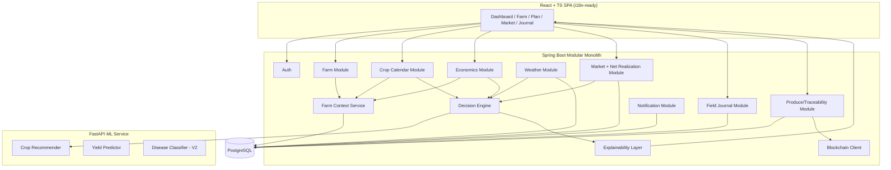

# FarmChain — Master Engineering Blueprint v2.0

> Builds on v1 (`FarmChain_Blueprint.md`) — nothing here contradicts it, this deepens the product and adds the intelligence/UX layer that makes FarmChain more than a CRUD app with weather and a smart contract bolted on. Same status as before: reference/planning document, not an active build against your Sept 2026 job-hunt timeline.

---

## 0. Repositioning

FarmChain is not a blockchain project with some farming features. It is:

**FARM INTELLIGENCE + CLIMATE INTELLIGENCE + CROP INTELLIGENCE + FARM ECONOMICS + MARKET INTELLIGENCE**, with **traceability** as one supporting capability, not the headline.

The single sentence that should drive every scoping decision from here on:

> "What should I grow, how should I grow it, what should I do today, and what is my crop approximately worth?"

Anything that doesn't serve one of those four questions is a candidate for cutting from MVP, regardless of how interesting it is to build.

---

## 1. Farm Digital Twin

**Real user value:** Every recommendation becomes contextual instead of generic. "Delay irrigation" instead of "rice needs X water" — the difference between a farming Wikipedia and an actual decision-support tool.

**What it actually is:** Not a new database technology — it's a **read model**: a service (`FarmContextService`) that assembles one coherent object from data already spread across `farms`, `farm_measurements`, `soil_profiles`, `farming_plans`, `expenses`, `harvests`, `weather_data`, and (new, below) `field_journal_entries`. Every recommendation-producing module (crop suggestion, calculator, alerts, economics) takes a `FarmContext` object as input rather than querying tables independently.

```java
public record FarmContext(
    UUID farmId,
    AreaInfo area,
    SoilProfile soil,
    CropPlanState currentPlan,       // nullable if no active crop
    List<CropHistoryEntry> cropHistory,
    List<WeatherObservation> recentWeather,
    WeatherForecast forecast,
    List<ExpenseSummary> expenseHistory
) {}
```

**Data lifecycle:** `FarmContext` is assembled on-demand (cached per-farm for a short TTL, e.g. 15 min) — it is a derived view, never itself the source of truth, so there's no dual-write consistency problem.

**Privacy:** GPS + soil data never leave the backend to any third-party call unbatched — weather/market lookups use the farm's district/lat-lon only, not any farmer-identifying data, when calling external free APIs.

**Classification:** MVP (as a lightweight assembler service over existing MVP tables) — this isn't a new feature to build later, it's an architectural pattern to apply from Sprint 2 onward so every later module already has "context-aware" as its default, not a retrofit.

---

## 2. Dynamic Crop Calendar (Rule Engine, Not ML)

**Real value:** Static "day 30: apply fertilizer" calendars ignore reality. A farmer whose region got unexpected rain shouldn't irrigate on schedule anyway.

**Architecture:**

```
farming_plans.sowing_date + crop_varieties.stage_durations (knowledge base)
        → generates farming_tasks with target_date (deterministic)

Daily scheduled job:
  for each ACTIVE plan with a task due in next 48h:
    evaluate task against current FarmContext + forecast
    IF task.type == IRRIGATION AND forecast.rainfall_next_24h > threshold:
        → mark task SUGGESTED_POSTPONE, notify farmer, do not auto-reschedule
    ELSE:
        → normal reminder
```

Task generation itself (day 0/7/15/30... derived from `crop_varieties` stage-duration data) is a deterministic lookup, not ML. The *modification* layer (postpone suggestion) is also a deterministic rule against weather data — **no ML anywhere in this module.** This is a good interview example of "ML wasn't used because it wasn't needed."

**MVP/V1:** Static task generation → MVP. Weather-aware postponement suggestions → V1 (depends on weather module being live first).

---

## 3. Farm Economics Engine

**Extends** the v1 cost/profit calculator (§17 in v1) into a proper module.

```
Total Investment = Σ(expenses by category)
Expected Revenue = Expected Yield (midpoint of range) × Current Modal Market Price
Expected Profit   = Expected Revenue − Total Investment
Profit Margin %   = Expected Profit / Expected Revenue × 100
Break-even Price  = Total Investment / Expected Yield
Break-even Qty    = Total Investment / Current Modal Market Price
```

All labeled **ESTIMATED** in the UI, never as a guarantee. After harvest, `harvests.actual_quantity_kg` + actual sale price (farmer-entered) populate an **Estimated vs Actual** comparison view — this closes the feedback loop and is also what eventually validates (or invalidates) the yield-prediction model's usefulness.

**New table:**
```sql
CREATE TABLE economics_snapshots (
    id UUID PRIMARY KEY DEFAULT gen_random_uuid(),
    plan_id UUID NOT NULL REFERENCES farming_plans(id),
    snapshot_type VARCHAR(20) NOT NULL,  -- ESTIMATED, ACTUAL
    total_investment DECIMAL(12,2),
    expected_revenue DECIMAL(12,2),
    expected_profit DECIMAL(12,2),
    profit_margin_pct DECIMAL(6,2),
    break_even_price DECIMAL(10,2),
    computed_at TIMESTAMPTZ DEFAULT now()
);
```

**Classification:** MVP — this is core to "what is my crop worth," one of the four founding questions.

---

## 4. Sell Now or Wait — Market Trend Signal

**Real value, honestly scoped:** Farmers should not be told to "wait" based on a fabricated price prediction. This module gives **descriptive** trend information only.

```
trend = classify_trend(last_N_days_modal_prices)
  → RISING     : last 7-day slope > +2%
  → FALLING    : last 7-day slope < -2%
  → STABLE     : within ±2%
  → INSUFFICIENT_DATA : fewer than 5 price points in window
```

UI copy: *"Prices for wheat in your district have been rising over the last week (₹X→₹Y). This reflects historical trend only, not a prediction of future prices."* — the disclaimer is not optional boilerplate, it's load-bearing given this is a financial decision. **No ML forecasting model here for MVP/V1** — a real time-series price-forecasting model is a legitimate V2/future feature but requires far more data + validation rigor than a portfolio MVP can responsibly claim; shipping a badly-validated price forecast is worse than shipping none.

**Classification:** V1 (deterministic trend classification only). Actual forecasting → Future, explicitly gated behind having enough historical data + proper backtesting.

---

## 5. Net Realization Engine

**Real value:** This is one of the most genuinely differentiated features — most price-comparison tools stop at listed price and mislead farmers into traveling further for a worse net outcome.

```
net_realization(market) = market.modal_price − transport_cost_per_kg(farm_location, market.location) − market_fee_per_kg
```

`transport_cost_per_kg` for MVP: a simple distance-based heuristic (₹/km/kg, farmer-configurable default) rather than a real logistics API (which would violate ₹0). `market_fee_per_kg`: sourced from mandi fee schedules where publicly published, otherwise left as a farmer-adjustable input defaulting to 0 with a visible "fee not available for this market" note — **never silently assume zero and hide that assumption.**

Ranks markets by net realization, not raw price, in the market intelligence UI.

**Classification:** V1 — depends on market price ingestion (V1) already being live.

---

## 6. Climate Risk Score — Explicitly Heuristic

```
climate_risk_score = weighted_sum(
    heat_risk:        f(forecast_max_temp vs crop.optimal_temp_range),
    excess_rain_risk:  f(forecast_rainfall vs crop.flood_sensitivity),
    drought_risk:      f(recent_rainfall_deficit vs crop.water_need),
    extreme_weather:   f(active_weather_alerts)
) → 0–100
```

**This is explicitly labeled in the UI and docs as a heuristic risk indicator, not a scientifically validated climate model** — weights are assigned deterministically from agronomic thresholds documented per crop, not learned or invented. This is stated up front precisely so it's never mistaken for more than it is.

**Classification:** V1.

---

## 7. Soil Health Intelligence

MVP: manual entry (already in v1's `soil_profiles`). **Soil test report upload/OCR is V2, not MVP** — OCR + structured extraction from photographed lab reports is a real computer-vision problem with meaningful failure modes; doing it badly would produce wrong NPK numbers feeding directly into fertilizer dosage calculations, which is a genuine harm path. When implemented: OCR extracts, but **any field the OCR can't confidently parse stays null and is flagged for manual confirmation** — an LLM must never be allowed to "fill in" a plausible-looking NPK value for a field the report didn't clearly contain.

**Classification:** Manual entry → MVP. OCR extraction → V2, with a hard requirement that low-confidence fields fall back to manual entry rather than an inferred guess.

---

## 8. Crop Rotation Intelligence

Deterministic rule table: `(previous_crop, region) → suggested_next_crops[]` sourced from published agronomic rotation guidance (e.g., legume-after-cereal for nitrogen fixation is a standard, sourceable rule), each suggestion carrying its source and a plain-language "why" (soil nitrogen replenishment, pest cycle break, etc.). Never a bare ranked list without reasoning.

**Classification:** V1 — cheap to build (lookup table) once crop history exists, but not core-path for MVP's four founding questions.

---

## 9. Field Journal

```sql
CREATE TABLE field_journal_entries (
    id UUID PRIMARY KEY DEFAULT gen_random_uuid(),
    plan_id UUID NOT NULL REFERENCES farming_plans(id),
    entry_type VARCHAR(30),  -- NOTE, PHOTO, FERTILIZER_APPLIED, PEST_OBSERVED, IRRIGATION_DONE
    observed_stage VARCHAR(50),
    notes TEXT,
    image_url TEXT,
    logged_at TIMESTAMPTZ DEFAULT now()
);
```

Simple, farmer-controlled timeline; images through Cloudinary (existing free-tier integration). This is explicitly future ML training data — flagged as such but not depended on for any MVP/V1 model, because you'd have zero journal entries at launch.

**Classification:** V1 — genuinely useful on its own (a farmer's own record) even before any ML use.

---

## 10. Crop Growth Timeline (Expected vs Observed)

Combines `farming_tasks` expected stage dates with `field_journal_entries.observed_stage` timestamps into a simple visual comparison ("expected flowering by day 45, you logged flowering on day 48 — normal variation" vs "significantly delayed, check for stress factors"). Deterministic comparison against the knowledge-base stage-duration ranges, not ML.

**Classification:** V1, depends on Field Journal.

---

## 11. Explainable Recommendation Layer

**This is a cross-cutting requirement, not a feature to schedule separately** — it constrains how §Crop Recommendation and §Yield Prediction (from v1) must be built from day one.

```java
public record RecommendationExplanation(
    String subject,                 // e.g. "Maize"
    int suitabilityScore,           // 0-100, if applicable
    List<MatchedCriterion> matched, // "Suitable temperature", "Compatible soil"
    List<RiskFlag> risks,           // "Moderate heat risk"
    String basisType,               // RULE_BASED | ML_RANKED | HYBRID
    String modelVersion,            // null if pure rule-based
    Double confidence,              // null if not applicable
    List<KnowledgeSource> sources
) {}
```

Every recommendation-producing endpoint returns this structure, not a bare label/score. The frontend renders it as the "Why this crop?" checklist shown in v1 §UI direction — this document just formalizes it as an API contract requirement so it can't be skipped under deadline pressure later.

**Classification:** MVP-level constraint (applies even to the rule-based-only MVP recommendation engine — explainability doesn't require ML to exist first).

---

## 12. Decision Engine

The component that resolves potentially conflicting signals before anything reaches the explainability layer:

```
Inputs: FarmContext, Weather, Agricultural Knowledge, Market Data, ML Prediction (if available), History
                              ↓
                     Decision Engine
   1. Apply hard constraints first (season/region eligibility) — these can VETO regardless of ML score
   2. Apply deterministic rules (soil/water match) — contribute to score
   3. If ML prediction available AND confidence ≥ threshold → blend as re-ranking signal only
   4. If ML unavailable/low-confidence → rule-based ranking only, explicitly flagged as such
   5. Missing data → do not silently default; explanation lists what was unavailable
                              ↓
                  Ranked, Explained Recommendation
```

The critical rule, stated explicitly so it can't drift during implementation: **ML never overrides a hard deterministic constraint** (e.g., ML cannot recommend a crop that's out of season for the region — that's an eligibility gate, not a preference). This is the answer to "why isn't everything ML" in the interview section below.

**Classification:** MVP-level architectural pattern — even before ML exists, this is just "rule engine," and ML slots into step 3 later without restructuring anything.

---

## 13. Data Provenance — Enforced at Schema Level

v1 already required `source_name`/`source_url`/`published_date` on `agricultural_knowledge`. v2 extends this pattern as a **reusable pattern**, not a one-off table field:

```sql
CREATE TABLE data_sources (
    id UUID PRIMARY KEY DEFAULT gen_random_uuid(),
    name VARCHAR(255) NOT NULL,        -- 'ICAR', 'IMD', 'Agmarknet'
    source_type VARCHAR(50),            -- GOVERNMENT, RESEARCH, DERIVED
    url TEXT,
    reliability_note TEXT
);
```
Every fact-bearing table (`agricultural_knowledge`, `market_prices`, `weather_data`) references `data_sources(id)` via FK instead of a free-text string — prevents source-name drift/typos and makes a future "show me everything sourced from X" admin view trivial.

**Classification:** MVP — this is schema discipline, costs nothing extra to build correctly from Sprint 0.

---

## 14–16. Voice, Multilingual, i18n Architecture

**Voice-first assistant:** genuinely valuable for low-literacy users, but **cannot be ₹0 at any real quality** — free browser Speech-to-Text (Web Speech API) is Chrome-only and unreliable for Hindi/Hinglish code-switching; a real STT/TTS pipeline (e.g. cloud STT) has per-request cost past small free allowances. **Classification: Future, paid-infra-required** — labeled honestly per the ₹0 rule rather than pretending a free path exists. A text-based Hindi/Hinglish chat interface (reusing the RAG assistant from v1 §20) is the ₹0-feasible substitute and should be the actual V2 target, with voice explicitly deferred until there's revenue or grant funding to justify the API cost.

**i18n architecture:** React with `react-i18next`, all UI strings in translation JSON from day one (`en.json`, `hi.json`) even though only English ships in MVP — retrofitting i18n after hardcoding strings is expensive; doing it from Sprint 0 is nearly free. Units (hectare/acre/bigha) and agricultural terms get their own translation namespace since "NPK," "quintal," etc. need contextual, not literal, translation.

**Classification:** i18n scaffolding → MVP (cheap now, expensive later). Actual Hindi translation content → V1. Voice → Future.

---

## 17–18. Disease Detection & Yield Prediction — Governance Additions

Both carry forward from v1 unchanged in approach, with one addition: **model governance** (next section) applies to both, and both must implement an explicit **refuse-to-predict** path:

- Disease detection: if image quality/confidence is below threshold → "Unable to identify with confidence — consult local agricultural extension officer" rather than a low-confidence guess presented as an answer.
- Yield prediction: if farm's feature values fall far outside the training data's distribution (e.g., an unusually large farm, an unlisted variety) → "Insufficient comparable data for a reliable estimate" rather than extrapolating silently.

---

## 19. Farm Performance Score — Explicitly Heuristic, Same Discipline as Climate Risk

```
performance_score = weighted_combination(
    yield_efficiency:  actual_yield / knowledge_base_expected_yield,
    cost_efficiency:   knowledge_base_expected_cost / actual_cost,
    water_efficiency:  recommended_water / actual_water_logged  (requires Field Journal data)
)
```
Requires actual harvest history to mean anything — **cannot be shown before a farmer's first completed harvest cycle**, and the UI must say so rather than showing a meaningless score off zero data.

**Classification:** V2 (structurally depends on Field Journal + at least one Economics-Actual snapshot existing).

---

## 20. Notification Engine — Priority Model

```sql
CREATE TABLE notification_preferences (
    user_id UUID PRIMARY KEY REFERENCES users(id),
    critical_channel VARCHAR(20) DEFAULT 'IN_APP',  -- IN_APP, EMAIL, BOTH
    high_channel VARCHAR(20) DEFAULT 'IN_APP',
    digest_medium_low BOOLEAN DEFAULT TRUE  -- batch medium/low into a daily digest instead of real-time
);
```
Priority mapping: CRITICAL (extreme weather, disease-risk spike) → immediate, HIGH (irrigation/fertilizer due today) → immediate, MEDIUM/LOW (market price movement, general tips) → daily digest by default. This directly implements the "do not spam" requirement as a schema-level default rather than a UI afterthought.

**Classification:** MVP for CRITICAL/HIGH in-app only (email requires the free-tier email service from v1's cost table, which has a low send cap — reserve it for CRITICAL only). Full preference center → V1.

---

## 21. Offline / Low-Connectivity

Frontend caches last-fetched weather/plan/calendar data in browser storage (in-memory + IndexedDB via a service worker, **not localStorage per the artifact constraint if this were ever built as an artifact — for the real app, IndexedDB is fine**) with a visible "Last updated Xh ago" badge on every data card that could be stale. No feature claims full offline functionality — this is "graceful degradation," not offline-first architecture (which would be a much larger V2/Future undertaking involving conflict resolution for offline writes).

**Classification:** V1 (read-only caching + staleness indicator). True offline write-sync → Future, explicitly out of scope until justified by real usage data showing it's needed.

---

## 22. Marketplace — Deliberately Deferred

MVP/V1 ship **market intelligence only** (price visibility, net realization ranking) — no listing, negotiation, or transaction flow. A real marketplace needs payments, dispute resolution, buyer verification, and logistics — each a project-sized scope on its own that would blow the ₹0/solo-developer constraint. Correctly scoping this *out* is itself a defensible product decision, not a gap.

**Classification:** Future — explicitly not V2. Revisit only after the intelligence layer has real users validating demand for a transaction layer.

---

## 23. Blockchain — Reframed (unchanged principle from v1, restated for emphasis)

No change to v1 §19's design. Restating the boundary explicitly because it's easy to scope-creep: **weather, ML predictions, journal entries, economics snapshots — none of these ever touch the chain.** Only `produce_batches` lifecycle events do. If a future feature proposes putting something else on-chain, the default answer is no unless it specifically needs third-party-verifiable tamper-evidence that a Postgres audit log can't provide.

---

## 24. QR Traceability — Privacy Refinement

Public `/batches/{qr}/trace` view (from v1) must return a **redacted farmer view**: farm's district/region (for provenance authenticity) but never farmer name, phone, exact GPS, or contact info. Add explicit test coverage asserting the public endpoint's DTO excludes those fields, so a future accidental field addition to the entity doesn't leak through.

---

## 25. Trust & Safety — Recommendation Provenance Levels

Every piece of farmer-facing information carries one of four explicit labels, enforced by the `basisType` field from §11:

| Label | Meaning |
|---|---|
| **Verified Guidance** | Direct from sourced `agricultural_knowledge` entry |
| **Rule-Based Recommendation** | Derived via Decision Engine deterministic rules |
| **ML Prediction** | Model output, always shown with confidence + model version |
| **AI-Generated Explanation** | RAG assistant's phrasing of the above — never a new fact source itself |

This hierarchy is the actual answer to "how do you prevent AI hallucinations" — the AI layer is only ever a *phrasing* layer over verified data, never an independent fact generator.

---

## 26. Final Feature Matrix

| Feature | MVP | V1 | V2 | Future | ML? | Blockchain? | ₹0? |
|---|---|---|---|---|---|---|---|
| Farm profile + area calc | ✓ | | | | No | No | Yes |
| Farm Digital Twin (context assembler) | ✓ | | | | No | No | Yes |
| Deterministic input calculator | ✓ | | | | No | No | Yes |
| Rule-based crop recommendation | ✓ | | | | No | No | Yes |
| Explainability layer | ✓ | | | | N/A | No | Yes |
| Decision Engine (rule-only mode) | ✓ | | | | No | No | Yes |
| Weather ingestion + basic alerts | ✓ | | | | No | No | Yes |
| Dynamic crop calendar (static gen) | ✓ | | | | No | No | Yes |
| Farm Economics (estimated) | ✓ | | | | No | No | Yes |
| Data provenance schema | ✓ | | | | N/A | No | Yes |
| i18n scaffolding (EN only) | ✓ | | | | No | No | Yes |
| Notifications (critical/high, in-app) | ✓ | | | | No | No | Yes |
| Market price display (sourced) | ✓ | | | | No | No | Yes |
| Produce batch record (DB only) | ✓ | | | | No | No | Yes |
| **— MVP boundary —** | | | | | | | |
| ML crop recommendation (re-ranker) | | ✓ | | | Yes | No | Yes |
| Weather-aware task postponement | | ✓ | | | No | No | Yes |
| Sell Now/Wait trend signal | | ✓ | | | No | No | Yes |
| Net Realization ranking | | ✓ | | | No | No | Yes |
| Climate Risk Score (heuristic) | | ✓ | | | No | No | Yes |
| Crop rotation suggestions | | ✓ | | | No | No | Yes |
| Field Journal | | ✓ | | | No | No | Yes |
| Growth timeline (expected vs observed) | | ✓ | | | No | No | Yes |
| Yield prediction | | ✓ | | | Yes | No | Yes |
| Blockchain traceability | | ✓ | | | No | Yes | Yes (testnet) |
| Offline caching + staleness badge | | ✓ | | | No | No | Yes |
| Full Hindi translation | | | ✓ | | No | No | Yes |
| Disease detection | | | ✓ | | Yes | No | Yes |
| Soil report OCR | | | ✓ | | Limited (OCR) | No | Yes |
| RAG farmer assistant (text) | | | ✓ | | Yes (retrieval) | No | Yes |
| Farm Performance Score | | | ✓ | | No | No | Yes |
| Voice assistant | | | | ✓ | Yes | No | **No — paid infra** |
| Actual marketplace/transactions | | | | ✓ | No | Maybe | No — needs payments infra |
| Price forecasting (predictive, not trend) | | | | ✓ | Yes | No | Needs validated data first |

---

## 27. Final Architecture (updated)



Key structural change from v1: **the Decision Engine + Explainability Layer sit between every recommendation-producing module and the ML service** — nothing calls the ML service directly and returns its output raw to the frontend.

---

## 28. Final Database — Delta from v1

New tables introduced in v2 (in addition to full v1 schema): `economics_snapshots`, `field_journal_entries`, `data_sources` (+ FK from `agricultural_knowledge`/`market_prices`/`weather_data`), `notification_preferences`, and model-governance tables:

```sql
CREATE TABLE ml_models (
    id UUID PRIMARY KEY DEFAULT gen_random_uuid(),
    model_name VARCHAR(100),       -- 'crop_recommender', 'yield_predictor'
    version VARCHAR(30) NOT NULL,
    dataset_version VARCHAR(30),
    trained_at TIMESTAMPTZ,
    evaluation_metrics JSONB,      -- actual measured metrics, never asserted
    is_active BOOLEAN DEFAULT FALSE
);

CREATE TABLE prediction_logs (
    id UUID PRIMARY KEY DEFAULT gen_random_uuid(),
    model_id UUID NOT NULL REFERENCES ml_models(id),
    farm_id UUID REFERENCES farms(id),
    input_features JSONB,
    prediction JSONB,
    confidence DECIMAL(5,4),
    created_at TIMESTAMPTZ DEFAULT now()
);
```
`ml_models.is_active` supports rollback: only one model per `model_name` active at a time, switching is a single UPDATE, and `prediction_logs` retains history for auditing "what did the system tell this farmer, using which model" — necessary given these predictions influence real farming decisions.

---

## 29. Final API Map — Delta from v1

New/changed endpoints beyond v1 §13:

| Method | Endpoint | Purpose |
|---|---|---|
| GET | `/farms/{id}/context` | Returns assembled FarmContext (mainly internal, exposed read-only for debugging/admin) |
| GET | `/plans/{id}/calendar` | Dynamic task list with any weather-driven postponement flags |
| GET | `/plans/{id}/economics?type=ESTIMATED\|ACTUAL` | Economics snapshot |
| GET | `/market/net-realization?crop=&farmLocation=` | Ranked markets by net realization, not raw price |
| GET | `/plans/{id}/climate-risk` | Heuristic score + breakdown, labeled as such |
| POST | `/plans/{id}/journal` | Add field journal entry |
| GET | `/plans/{id}/growth-timeline` | Expected vs observed stage comparison |
| GET | `/recommendations/{id}/explanation` | Full `RecommendationExplanation` object |
| GET | `/admin/ml-models` | Model governance view (Admin only) |

All list endpoints adopt consistent `?page=&size=&sort=` pagination; all mutation endpoints requiring exactly-once semantics (batch creation, blockchain event submission) accept an `Idempotency-Key` header.

---

## 30. Final ML Architecture

Two production ML models at V1 (crop recommender, yield predictor), a third at V2 (disease classifier). All three share:

- A `ml_models` governance record before serving
- A mandatory confidence threshold below which the Decision Engine falls back to rule-based-only output
- Logged predictions (`prediction_logs`) for later evaluation against actual outcomes (`harvests`, `economics_snapshots` ACTUAL)
- No model is ever the sole author of a farmer-facing recommendation — always mediated by the Decision Engine

Retraining strategy: manual, triggered when enough new logged actuals exist to meaningfully re-evaluate (no automated retraining pipeline at MVP/V1 scale — that's a V2+/Future concern requiring MLOps infra beyond ₹0 justification).

---

## 31. Final Blockchain Architecture

Unchanged from v1 §19, reaffirmed scope boundary from §23 above. No new on-chain data types introduced in v2.

---

## 32. Final UI/UX System

Dashboard hierarchy (implements §30's "what does the farmer need today" ordering):

1. **Today's critical action** (if any — e.g. postpone irrigation)
2. **Weather snapshot** (today + tomorrow only, not a 7-day grid on the main view)
3. **Crop health/risk flag** (if elevated)
4. **Upcoming task** (single next task, not a list)
5. **Market snapshot** (current price + trend arrow for their active crop only)
6. **Economics snapshot** (estimated profit-to-date, one number)

Everything else (full calendar, full market comparison, journal, growth timeline) lives one tap away — progressive disclosure, not a single dense screen. Visual identity: warm off-white base (reusing Jankalyan's editorial palette direction), deep green + soil-brown accents, serif headings/sans body for the same high-contrast trustworthy feel, explicit avoidance list unchanged from v1 §21 (no purple gradients, no glassmorphism, no decorative charts).

Mobile bottom navigation: justified here (unlike a typical dashboard app) because farmers are mobile-first and a bottom nav keeps the 4-5 core sections (Home, Plan, Market, Journal, Profile) reachable one-thumb.

---

## 33. Final ₹0 Deployment Architecture

No new infrastructure beyond v1 §22's table — v2 features (Farm Digital Twin, Decision Engine, Field Journal, Economics) are all backend logic + existing Postgres/Cloudinary, not new paid services. The only feature in this whole v2 pass that **cannot** be ₹0 is Voice (§14–16), and it is explicitly deferred to Future for that exact reason — consistent with the ₹0 audit requirement, nothing is quietly assumed free.

---

## 34. Final MVP Scope (aggressively reduced)

Everything above the "— MVP boundary —" line in §26. In plain terms: farm profile with area calc, context-aware rule-based crop recommendation with explanations, deterministic input calculator, basic weather + critical alerts, static crop calendar, estimated economics, sourced market price display, produce batch record (no chain yet). **No ML, no blockchain, no journal, no multi-language content in the true MVP** — those are the very next slice (V1), not part of proving the core loop.

---

## 35. Final Roadmap — Phased

| Phase | Contents | Depends on |
|---|---|---|
| 0 — Foundation | Repo, schema incl. `data_sources`/provenance FKs from day 1, i18n scaffolding, CI | — |
| 1 — Core Farmer Platform | Auth, Farm profile, FarmContext service, deterministic calculator, static crop calendar, rule-based recommendation + explainability, weather + critical alerts | Phase 0 |
| 2 — Intelligence | Economics module, Decision Engine formalized, Climate Risk Score, crop rotation, Field Journal, growth timeline | Phase 1 |
| 3 — Market Intelligence | Market ingestion, Net Realization, Sell Now/Wait trend | Phase 1 |
| 4 — Advanced AI | ML crop recommender + yield predictor wired into Decision Engine, model governance tables, prediction logging | Phase 2, 3 |
| 5 — Traceability | Produce batch + QR (DB-only) → smart contract + testnet integration | Phase 1 (batch can ship DB-only earlier; chain wiring is the Phase-5-specific work) |
| 6 — Scale/Polish | Notifications preference center, offline caching, full Hindi translation, disease detection (V2), security hardening pass | All above |

---

## 36. Final "START HERE" Checklist

1. Everything from v1 §32 Day 1 steps, unchanged
2. Additionally on Day 1: create the `data_sources` table and FK it into `agricultural_knowledge` from the very first migration — retrofitting provenance later is exactly the kind of thing that gets skipped under deadline pressure
3. Stand up `FarmContext` as an empty-but-typed service in Phase 1 even before most of its fields have real data — build every later module to consume it, not raw repositories, from the start
4. Build the `RecommendationExplanation` DTO before the first recommendation endpoint — retrofitting explainability onto an existing endpoint is more painful than building it in from the first line
5. Follow the Phase 0→6 order in §35; do not start Phase 4 (ML) before Phase 1's rule-based recommendation is genuinely working end-to-end — the rule-based version is what validates whether ML would even add value

---

## 37. Updated Interview Q&A

- **"Why isn't everything ML?"** → Deterministic rules are auditable, explainable, and don't hallucinate; ML is only added where a rule genuinely can't capture the pattern (ranking among many valid options, image classification). The Decision Engine makes this a hard architectural boundary, not a vague intention.
- **"How do you prevent AI hallucinations?"** → The AI/RAG layer is never an independent fact source — it only phrases retrieved, sourced `agricultural_knowledge` content (§25's provenance hierarchy). If retrieval finds nothing, it says so rather than generating a plausible-sounding answer.
- **"Why shouldn't the highest mandi price always be recommended?"** → Net Realization Engine (§5) — transport and fees can flip the actual best choice; this is the single most concrete "why did you build X" story in the whole platform.
- **"How does your model handle missing soil data?"** → It doesn't invent it — missing stays missing, and any recommendation/calculation depending on it is flagged as reduced-confidence or explicitly notes the missing input in its explanation.
- **"How do you know your crop recommendation is reliable?"** → I don't claim it's more reliable than it's been measured to be — `ml_models.evaluation_metrics` stores actual holdout performance, and low-confidence predictions fall back to rule-based output rather than a forced ML answer.
- **"Why modular monolith and not microservices?"** → Solo developer, ₹0 hosting budget; module boundaries (service-interface-only cross-module calls) already give the extraction path to real microservices later without a rewrite, at zero premature operational cost now.
- **"How do you keep the system ₹0?"** → Every dependency in §33/v1 §22's table is a genuinely free tier with its limitation documented; the one feature that isn't free (voice) is explicitly deferred rather than silently built on an assumed-free API that could break the whole cost model later.
